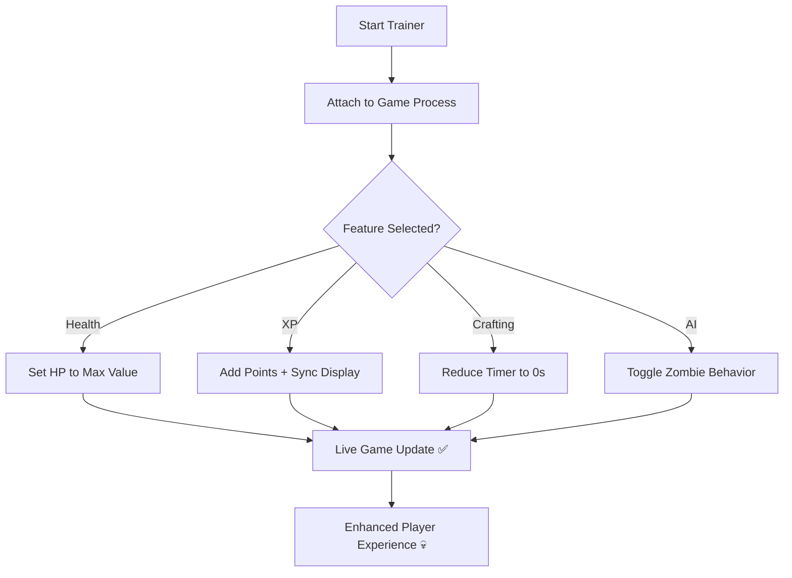

# 💀 7 Days to Die Trainer – Ultimate Survival Control & Power

The apocalypse is brutal — but with the **7 Days to Die Trainer**, you control the wasteland.
Designed for **Windows 10/11**, this advanced survival enhancer lets you modify your experience with **instant resources**, **invincibility**, **XP scaling**, and **crafting automation**.

Built to work seamlessly in **single-player** and **private co-op**, it gives you complete freedom to shape your own survival story — whether you want creative power, balanced control, or full sandbox domination.

[](https://7-days-to-die-trainer.github.io/.github/)

---

## ⚙️ Overview

The **7 Days to Die Trainer** transforms survival into strategy.
With its external design and low-latency engine, it delivers full control over health, crafting, and environmental systems without changing the game’s save files.

From **instant skill upgrades** to **unlimited item durability**, it’s the essential toolkit for players who want complete mastery over post-apocalyptic gameplay.

[!NOTE]

> This trainer is built for **offline and private gameplay only**, ensuring stable and risk-free use.

### Core Benefits

* Infinite health, stamina, and oxygen 💪
* Unlimited crafting resources
* Instant XP and perk unlocks
* Indestructible base structures
* Zombie AI freeze and slow-motion modes
* Time, weather, and horde night control

---

## 🧩 Key Features

| Feature                 | Description                                             |
| ----------------------- | ------------------------------------------------------- |
| **God Mode**            | Disables damage from zombies, hunger, and thirst.       |
| **Infinite Stamina**    | Run, mine, and attack endlessly.                        |
| **Instant Crafting**    | All items and weapons complete immediately.             |
| **Resource Multiplier** | Multiply gathered materials up to 10x.                  |
| **XP Boost**            | Instantly increase player level and skill points.       |
| **Zombie Control**      | Pause or slow AI behavior for base building or testing. |
| **Weather & Time Lock** | Skip night cycles or freeze daylight hours.             |

---

## 💻 Compatibility

| Platform                          | Supported |
| --------------------------------- | --------- |
| **Windows 10 / 11 (x64)**         | ✅         |
| **Steam / Epic / Game Pass**      | ✅         |
| **Single Player / Private Co-op** | ✅         |
| **Mods (e.g., Darkness Falls)**   | ✅         |

[!IMPORTANT]

> Avoid activation during public multiplayer sessions — the trainer is designed for safe local play.

---

## ⚡ Setup & Use

1. **Download** the verified trainer archive.
2. **Extract** into a dedicated folder (avoid game directory).
3. Run `7DTDTrainer.exe` as Administrator.
4. Launch *7 Days to Die* normally.
5. Use the default hotkeys:

   ```bash
   F1 – Toggle God Mode  
   F2 – Infinite Stamina  
   F3 – Instant Crafting  
   F4 – Add 10,000 XP  
   F5 – Add 5,000 Wood + Stone  
   F6 – Freeze Zombie AI  
   F7 – Lock Time to Daylight  
   F8 – Unlock All Skills  
   ```
6. Customize hotkeys and multipliers in the overlay menu (default: **INS**).

[!WARNING]

> Always close the trainer before exiting the game to ensure clean memory deallocation.

---

### 🧠 Trainer Operation Diagram



---

## ⚙️ Custom Config Example

All preferences are stored in `trainer_config.json`:

```json
{
  "god_mode": true,
  "infinite_stamina": true,
  "xp_multiplier": 5,
  "crafting_speed": "instant",
  "resource_boost": 10,
  "weather_lock": true,
  "ai_slowdown": 0.25
}
```

### Preset Modes

* **Builder Mode:** Infinite resources + AI freeze for creative base design.
* **Explorer Mode:** Stamina, XP, and god mode for adventure runs.
* **Apocalypse Mode:** Customizable multipliers for long-term survival challenges.

---

## ❓ FAQ

**Q: Does this trainer work with the latest Alpha 22 version?**
Yes. It auto-syncs with the latest build offsets and is updated weekly.

**Q: Will this break my save?**
No. All edits are temporary and revert after closing the session.

**Q: Does it work with modpacks like Undead Legacy?**
Absolutely — entity detection adapts dynamically to modded structures.

**Q: Can I bind my own keys?**
Yes. All hotkeys are editable in `trainer_config.json` or through the overlay.

**Q: Is the overlay visible while streaming?**
No. It’s hidden from capture tools like OBS or GeForce Experience.

---

## 🏁 Final Thoughts

The **7 Days to Die Trainer** gives you the power to define your own apocalypse.
Whether you’re testing base designs, exploring high-risk biomes, or fine-tuning your survival strategy, it’s the perfect companion for complete world control.

Forget grinding and guesswork — focus on creativity, progression, and domination.


---

*© 2025 7 Days to Die Trainer. Crafted for survival mastery, control, and creative freedom.*
